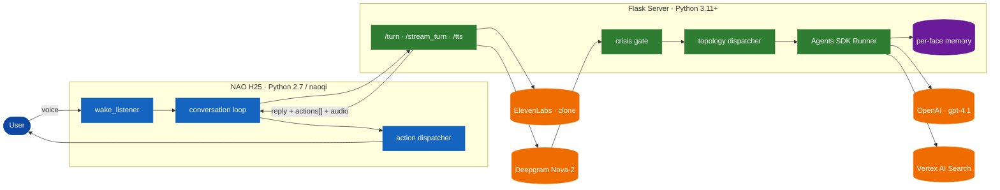
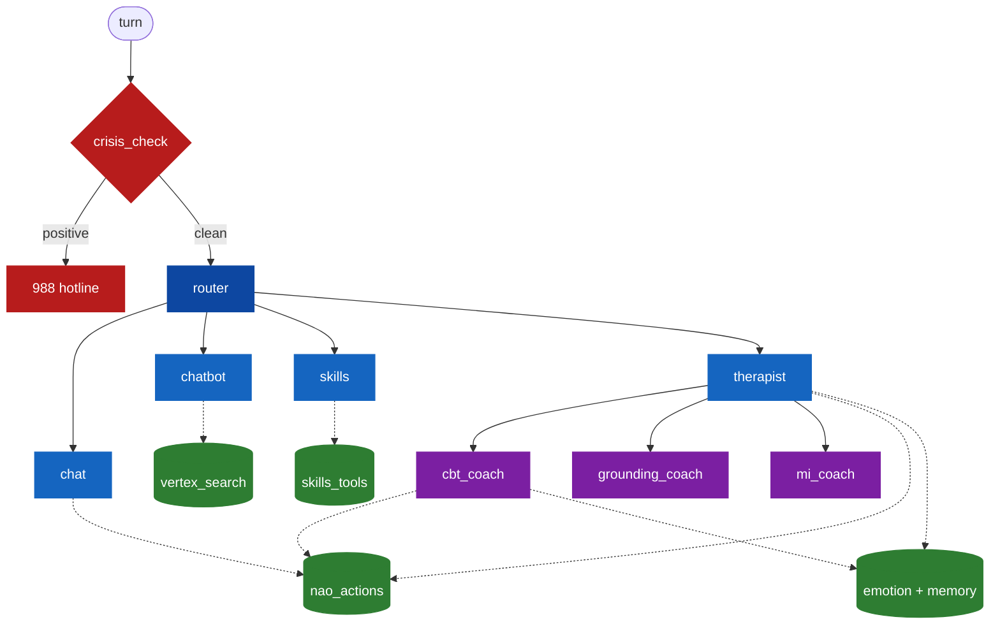
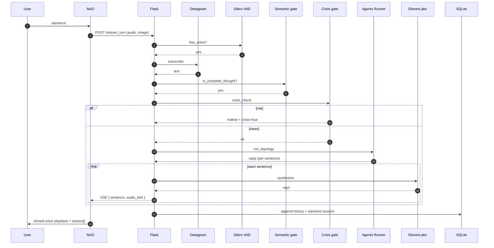
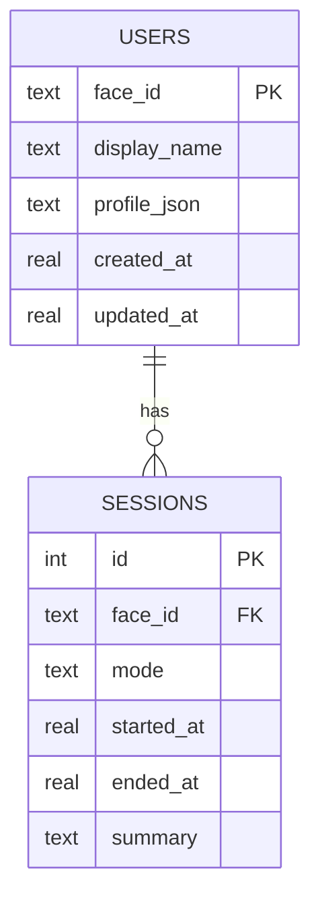

<div align="center">

# Nao‑OpenAI‑Morgan‑Assist

**A voice‑driven multi‑agent assistant for the NAO humanoid robot, built for Morgan State University.**

<p>
  
  
  
  
  
  
  
  
</p>

<sub>Aayush Shrestha · Advised by Dr. Shuangbao "Paul" Wang · Department of Computer Science, Morgan State University</sub>

<br/>


</div>

---

## Overview

NAO listens, sees, remembers, and replies in the user's own cloned voice. The robot streams audio to a Flask server that routes the turn through a graph of specialized agents (chat, RAG over a Morgan CS knowledge base, skills, therapy with CBT and motivational interviewing). A pre‑dispatch crisis gate, a runtime safety invariant, and per‑face memory give the system clinical and operational guardrails.

| Capability        | Implementation                                                                 |
|-------------------|---------------------------------------------------------------------------------|
| Speech‑to‑text    | **Deepgram Nova‑2** streaming ASR with keyword boosting (~150 ms)             |
| Endpointing       | **Silero VAD** + semantic "is the user done?" gate via `gpt-4.1-nano`         |
| Reasoning         | **OpenAI Agents SDK** — router → chat / chatbot / skills / therapist          |
| Therapy           | CBT thought records + grounding + Motivational Interviewing (OARS)            |
| Vision            | GPT‑4.1 multimodal — per‑turn JPEG, affect routing                             |
| Knowledge base    | **Vertex AI Search** (`csnavigator-kb-v7`)                                     |
| Voice             | **ElevenLabs Flash v2.5** voice cloning, falls back to NAO TTS                 |
| Memory            | SQLite — per‑face users, sessions, rolling LLM summaries, profile JSON        |
| Safety            | Pre‑dispatch crisis gate (988 hotline) + SAGE‑CBT supervisor‑veto topology    |
| Embodiment        | 18 NAO action tools (pose, gesture, dance, LEDs) executed in order            |

---

## Architecture



---

## Agent graph



| Agent | Role | Default model |
|---|---|---|
| **router** | triage + handoff | `gpt-4.1-nano` |
| **chat** | general chat + NAO actions | `gpt-4.1-nano` |
| **chatbot** | Morgan CS RAG via Vertex AI | `gpt-4.1-mini` |
| **skills** | time, weather, timers, todos | `gpt-4.1-nano` |
| **therapist** | empathy + handoffs + vision | `gpt-4.1-mini` |
| **cbt_coach** | Beck thought record (one step per turn) | `gpt-4.1-mini` |
| **grounding_coach** | 5‑4‑3‑2‑1, box breathing, body scan | `gpt-4.1-mini` |
| **mi_coach** | Motivational Interviewing (OARS) | `gpt-4.1-mini` |
| **crisis** | safety classifier | `gpt-4.1` |

---

## Repository

```
Nao-OpenAI-Morgan-Assist/
├─ nao/                    Python 2.7 — copy to /home/nao/nao_assist/
│  ├─ main.py              wake loop entry
│  ├─ conversation.py      record · POST · speak · execute
│  ├─ audio_handler.py     loose energy gate (server VAD finalizes)
│  ├─ stream_tts.py        SSE consumer + ElevenLabs MP3 playback
│  └─ utils/               face_naoqi · voice_clone · nao_execute · …
├─ server/                 Python 3.11+
│  ├─ server.py            Flask app
│  ├─ deepgram_asr.py      Nova-2 transcription
│  ├─ vad_silero.py        Silero VAD wrapper
│  ├─ semantic_endpoint.py LLM "is user done?" gate
│  ├─ elevenlabs_tts.py    Flash v2.5 voice clone
│  ├─ memory.py            users · sessions · rolling summaries
│  ├─ session.py           SQLiteSession (Agents SDK) + consent
│  ├─ safety.py            pre-dispatch crisis gate
│  ├─ invariant.py         SAGE-CBT runtime safety monitor
│  ├─ topologies/          passthrough · supervisor_veto · debate · shared_pool
│  ├─ agents/              router · chat · chatbot · skills · therapist · …
│  └─ tools/               nao_actions · vertex_search · emotion · memory_tools
├─ tests/redteam/          70-prompt SAGE-CBT red-team harness
├─ docs/                   design specs · plans
└─ PRD.md                  SAGE-CBT research thesis
```

---

## Quick start

### Server

```bash
cd server
python3.11 -m venv .venv && source .venv/bin/activate
pip install -r requirements.txt
```

Create `.env` at the repo root:

```env
OPENAI_API_KEY=sk-...
DEEPGRAM_API_KEY=...
ELEVENLABS_API_KEY=...
ELEVENLABS_VOICE_ID=...

GOOGLE_CLOUD_PROJECT=csnavigator-vertex-ai
VERTEX_DATASTORE_ID=csnavigator-kb-v7

NAO_IP=172.20.95.127
SERVER_IP=0.0.0.0
SERVER_PORT=5050

# Optional research layer (off by default)
# SAGE_TOPOLOGY=supervisor_veto
```

```bash
python -m server.server
```

### NAO

```bash
rsync -avz --delete nao/ nao@<robot-ip>:/home/nao/nao_assist/
ssh nao@<robot-ip> "python /home/nao/nao_assist/main.py"
```

Wake phrase: **"nao"** (optionally followed by a hint: *chat*, *morgan*, *therapy*, *skills*).

### Tests

```bash
python -m pytest -q
```

---

## HTTP API

| Method | Path             | Purpose                                        |
|--------|------------------|------------------------------------------------|
| `POST` | `/turn`          | one‑shot reply (JSON)                          |
| `POST` | `/stream_turn`   | streaming reply (SSE: sentence + audio + done) |
| `POST` | `/tts`           | ElevenLabs voice clone synthesis (MP3)         |
| `GET`  | `/health`        | liveness probe                                 |

**Multipart form fields:** `audio` (WAV), `image` (JPEG, optional), `username`, `hint`, `end_session`.

```jsonc
// /turn response
{
  "username":     "aayush",
  "user_input":   "how do i declare a cs major",
  "reply":        "You'll fill out the change-of-major form with the CS office...",
  "active_agent": "chatbot",
  "actions":      [{ "name": "change_eye_color", "args": { "color": "blue" } }],
  "crisis":       false,
  "suppress_image": false
}
```

---

## Request lifecycle



---

## Memory model

Two layers, one SQLite file (`config.SESSION_DB`).

| Layer                   | Owner               | Stores                                                           |
|-------------------------|---------------------|------------------------------------------------------------------|
| `SQLiteSession`         | OpenAI Agents SDK   | turn-by-turn message history per face_id                         |
| `users` · `sessions`    | `server/memory.py`  | display name, profile JSON, session summaries, started/ended_at  |



A returning user's last three session summaries are injected as a system preamble on every turn. `forget_user(face_id)` wipes the row, the session log, and the SDK chat history.

---

## SAGE‑CBT research layer

When `SAGE_TOPOLOGY` is set, the therapist subgraph is wrapped by a pluggable orchestration topology with a runtime‑monitorable safety invariant. Default behavior is unchanged when the flag is unset. See [PRD.md](PRD.md).

| Topology           | Intervention                                               | Role            |
|--------------------|------------------------------------------------------------|-----------------|
| `passthrough`      | none — vanilla Runner                                       | legacy default  |
| `supervisor_veto`  | SafetyAgent gates every reply pre‑emit                      | proposed        |
| `debate`           | therapist + cbt_coach draft; judge picks; safety observes   | baseline        |
| `shared_pool`      | three agents draft into scratchpad; therapist synthesizes   | baseline        |

> ∀ t, `proposed_reply(t)` contains risk ⇒ `final_reply(t) ≠ proposed_reply(t)` ∧ crisis_lockout within 1 turn.

---

## Configuration tips

- **Endpointing:** `nao/audio_handler.py` is intentionally permissive; final cut is in `server/vad_silero.py` + `server/semantic_endpoint.py`.
- **Latency budget:** target p50 < 1.5 s end‑to‑end. Deepgram ~150 ms, router (`gpt-4.1-nano`) ~150 ms first token, ElevenLabs ~240 ms per sentence.
- **Barge‑in:** head touch on NAO calls `tts.stopAll()` instantly. Acoustic barge is off by default to avoid self‑echo.
- **Vertex AI:** run `gcloud auth application-default login` once; without it `chatbot` returns "I'm not sure".

---

## License

Released under the [MIT License](LICENSE).

## Authors

- **Dr. Shuangbao "Paul" Wang** — Faculty Advisor / Principal Investigator. Chairperson, Department of Computer Science, Morgan State University.
- **Aayush Shrestha** — Lead Developer / Research Assistant. Department of Computer Science, Morgan State University.
