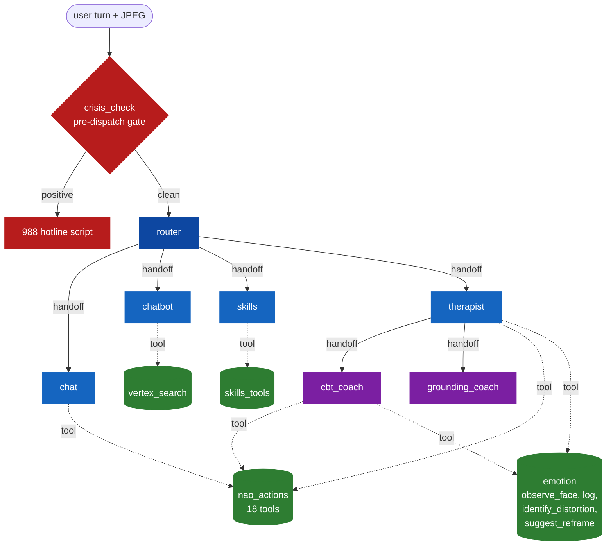
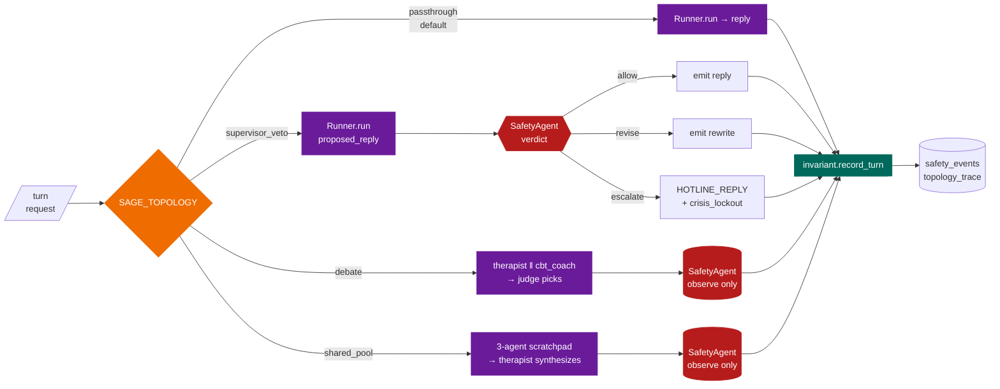
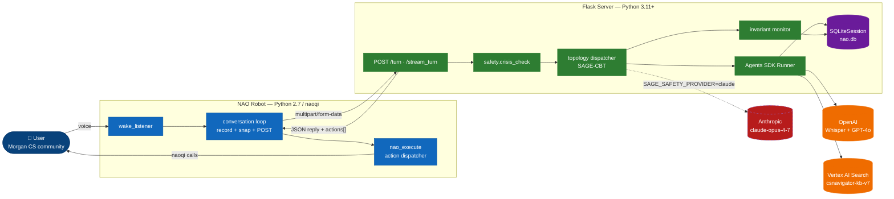
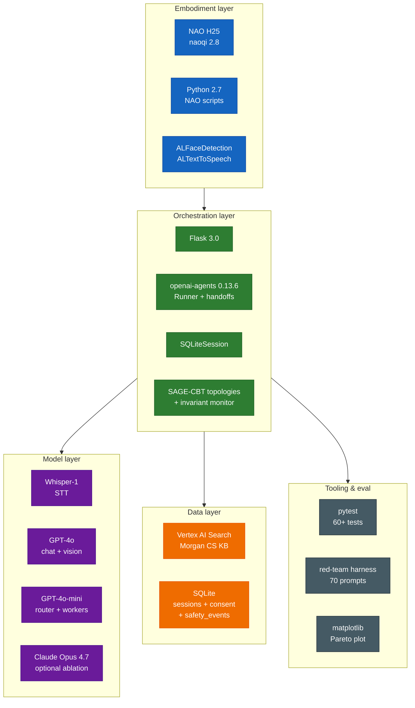
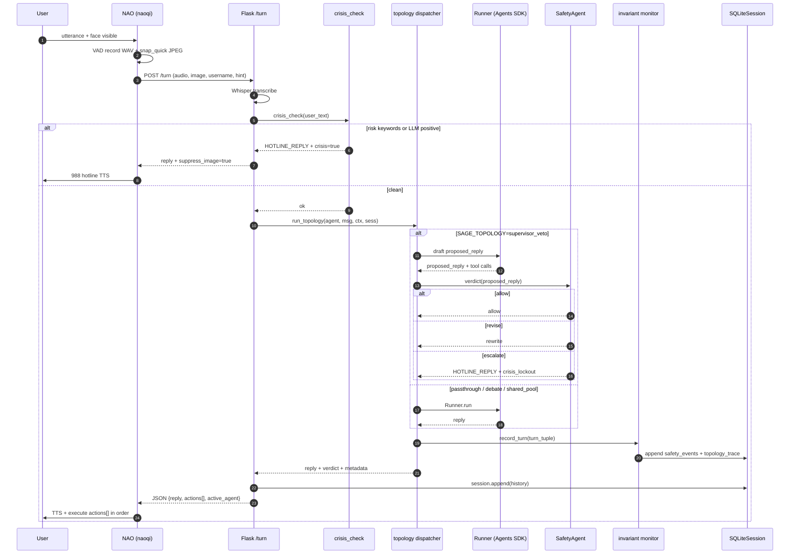
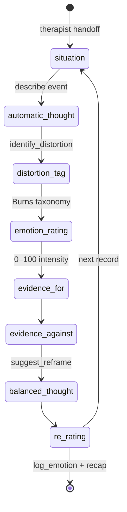

# 🤖 Nao-OpenAI-Morgan-Assist

[](#-license)
[](#-requirements)
[]()
[]()
[]()
[](PRD.md)

A voice-driven assistant that connects the **NAO humanoid robot** to **OpenAI (Whisper + GPT-4o)** and a **Vertex AI Search** knowledge base for the **Morgan State University (MSU) Computer Science Department** — now with a live research branch (**SAGE-CBT**) building a Supervisor-Veto multi-agent CBT dialogue architecture with a runtime-monitorable safety invariant.


---

## 📌 Overview
**Nao-OpenAI-Morgan-Assist** lets NAO:
- 🎤 **Listen** to users
- 📝 **Transcribe** speech with OpenAI **Whisper**
- 📂 **Retrieve** Morgan CS knowledge from **Vertex AI Search** (`csnavigator-kb-v7`)
- 💡 **Generate** answers with **GPT-4o** via the **OpenAI Agents SDK**
- 👁 **See** the user's face each turn and route on affect
- 🔊 **Speak** replies via NAO TTS

> Developed by **Aayush Shrestha** under the supervision of **Dr. Shuangbao "Paul" Wang**.

---

## ✨ Features
- 🧠 **OpenAI Agents SDK** – Multi-agent routing (router + chat, chatbot, skills, therapist with CBT/grounding sub-agents)
- 🗣 **Voice + Vision** – Whisper STT, GPT-4o multimodal (face emotion read from per-turn JPEG)
- 📚 **Morgan CS RAG** – Vertex AI Search retrieval for department knowledge
- 💙 **Therapy Mode** – Empathetic companion with CBT thought records, grounding exercises, per-session emotion logging, cross-session recaps
- 🛡 **Safety Gate** – Pre-dispatch crisis check (keyword + LLM) with 988 hotline fallback
- 👤 **Face Recognition** – On-robot naoqi ALFaceDetection for user recall
- 💾 **SQLiteSession** – SDK-managed conversation history + camera consent + therapy recaps + hierarchical memory (weekly themes, monthly personas)
- 🤖 **NAO Actions** – 18 tools (pose, gesture, move, dance, LEDs) captured into action queue for in-order execution
- 🧪 **SAGE-CBT research layer** *(optional, feature-flagged)* – Three pluggable orchestration topologies (Supervisor-Veto / Debate / SharedPool), a runtime-monitorable safety invariant, and a 70-prompt red-team harness. See [PRD.md](PRD.md).

---

## 🗂 Project Structure

```
Nao-OpenAI-Morgan-Assist/
├─ nao/                           # Python 2.7 — deploy this to the robot
│   ├─ main.py                    # Wake loop entry
│   ├─ wake_listener.py           # Wake phrase + hint extraction
│   ├─ conversation.py            # Single loop: record → POST /turn → speak + execute
│   ├─ audio_handler.py           # VAD + recording
│   ├─ processing_announcer.py    # Background "please wait"
│   ├─ config.py                  # IPs, ports
│   └─ utils/
│       ├─ camera_capture.py      # snap_quick() for per-turn JPEG
│       ├─ nao_execute.py         # Dispatches server actions to naoqi
│       ├─ face_naoqi.py          # Face reco/learning
│       ├─ ask_name_utils.py      # Name ask flow
│       ├─ exit_detection.py
│       ├─ name_utils.py
│       └─ speech.py              # Phrase pools + expressive TTS
├─ server/                        # Python 3.11+ Flask + OpenAI Agents SDK
│   ├─ server.py                  # POST /turn + /stream_turn + /greet + /health
│   ├─ safety.py                  # Pre-dispatch crisis gate
│   ├─ session.py                 # SQLiteSession + consent + recaps
│   ├─ invariant.py               # SAGE-CBT runtime safety monitor (research)
│   ├─ memory_rollup.py           # Weekly/monthly hierarchical memory
│   ├─ streaming.py               # Per-sentence SSE helpers
│   ├─ config.py
│   ├─ agents/                    # router, chat, chatbot, skills, therapist, cbt_coach, grounding_coach
│   ├─ tools/                     # nao_actions, vertex_search, emotion, skills_tools
│   ├─ topologies/                # SAGE-CBT: passthrough / supervisor_veto / debate / shared_pool (research)
│   ├─ tests/                     # pytest (60+ tests)
│   └─ requirements.txt
├─ tests/redteam/                 # SAGE-CBT red-team harness (50 single-turn + 20 multi-turn prompts)
├─ docs/                          # Design specs + implementation plans
├─ PRD.md                         # SAGE-CBT research thesis (v0.3)
├─ CLAUDE.md, README.md, LICENSE, pytest.ini
```

---

## ⚙️ Requirements
- **Python 2.7** (NAO side, NAOqi SDK only)
- **Python 3.11+** (server; `openai-agents`, `openai>=1.50`, `flask`, `google-cloud-discoveryengine`, optional `anthropic` for SAGE-CBT Claude ablation)

## 🚀 Quick Start

### 1) Server (Python 3.11+)
```bash
cd server
python3 -m venv .venv && source .venv/bin/activate
pip install -r requirements.txt
```

Create a `.env` at repo root (start from `.env.example`):
```
OPENAI_API_KEY=sk-your-key

# Vertex AI Search (Morgan CS RAG). For dev, run `gcloud auth application-default login` once.
GOOGLE_CLOUD_PROJECT=csnavigator-vertex-ai
VERTEX_LOCATION=us
VERTEX_DATASTORE_ID=csnavigator-kb-v7

NAO_IP=172.20.95.111
SERVER_IP=0.0.0.0

# SAGE-CBT research layer (optional; off by default)
# SAGE_TOPOLOGY=supervisor_veto          # passthrough | supervisor_veto | debate | shared_pool
# SAGE_SAFETY_PROVIDER=openai            # openai | claude
# ANTHROPIC_API_KEY=                     # required only when SAGE_SAFETY_PROVIDER=claude
```

Run the server:
```bash
python -m server.server        # dev
# or: gunicorn -w 1 -b 0.0.0.0:5000 server.server:app
```

### 2) NAO (Python 2.7)
Copy the `nao/` folder to the robot:
```bash
scp -r nao/ nao@<nao-ip>:/home/nao/nao_assist/
ssh nao@<nao-ip>
export SERVER_IP=<server-host>
python /home/nao/nao_assist/main.py
```

Wake phrases: "nao", "hey nao", or with hints: "morgan assist", "therapy", "mini nao".

### 3) Run tests
```bash
python -m pytest -q
# 60+ tests pass (53 core + 7 SAGE-CBT invariant)
```

### 4) (Research) Run the SAGE-CBT red-team sweep
```bash
# Dry-run (no OpenAI credits — validates harness plumbing only)
python -m tests.redteam.runner --topology supervisor_veto --budget single --dry-run

# Full sweep: 3 topologies × 2 adversary budgets → Pareto plot (~$1.20)
bash tests/redteam/run_all.sh
open logs/pareto.png
```

## 🔌 API

**POST `/turn`** (multipart):
- `audio` (WAV), `image` (JPEG, optional), `username`, `hint` (`chat`|`morgan`|`therapy`|`skills`), `end_session` (bool)

**Response JSON:**
```json
{ "username": "alice", "user_input": "...", "reply": "...",
  "active_agent": "therapist",
  "actions": [{"name":"change_eye_color","args":{"color":"blue"}}],
  "crisis": false, "suppress_image": false }
```

`actions[]` is the ordered list NAO executes. Router automatically hands off to the right specialist when `hint` is null.

## 🧭 Agent Graph



| Agent | Role | Model |
|---|---|---|
| **router** | triage + handoff | `gpt-4o-mini` |
| **chat** | general chat + NAO actions | `gpt-4o-mini` |
| **chatbot** | Morgan CS RAG via Vertex AI Search | `gpt-4o-mini` |
| **skills** | time, weather, timers, todos | `gpt-4o-mini` |
| **therapist** | empathy + CBT/grounding handoffs + vision | `gpt-4o` |
| **cbt_coach** | Beck 7-column thought record | `gpt-4o` |
| **grounding_coach** | 5-4-3-2-1, box breathing, body scan | `gpt-4o` |

---

## 🧪 SAGE-CBT Research Layer (optional, feature-flagged)

When `SAGE_TOPOLOGY != "passthrough"`, the therapist subgraph is wrapped by a pluggable orchestration topology. The research thesis ([PRD.md](PRD.md)) compares three on a 70-prompt red-team. The SafetyAgent provider is swappable at runtime.



**Topologies**

| Name | Intervention | Role in paper |
|---|---|---|
| `passthrough` | none — existing behavior | legacy default |
| `supervisor_veto` | SafetyAgent **gates** every reply pre-emit | proposed contribution |
| `debate` | therapist + cbt_coach draft; judge picks; Safety observes | baseline |
| `shared_pool` | three agents draft into scratchpad; therapist synthesizes | baseline |

**SafetyAgent provider**

| `SAGE_SAFETY_PROVIDER` | Model | Notes |
|---|---|---|
| `openai` *(default)* | `gpt-4o` | Always available |
| `claude` | `claude-opus-4-7` | Requires `ANTHROPIC_API_KEY`; treated as ablation |

**Runtime safety invariant** (see [PRD §7.5](PRD.md)):

> ∀ t, `proposed_reply(t)` contains risk ⇒ `final_reply(t) ≠ proposed_reply(t)` ∧ crisis_lockout within 1 turn.

The monitor at `server/invariant.py` evaluates this over a sliding 5-turn window per user and logs violations to SQLite regardless of which topology is active. Supervisor-Veto *structurally* satisfies it; Debate and SharedPool observe-only — the gap is the experimental contrast.

## 🛠 Configuration Tips

Latency tuning (speech end detection): tweak in audio_handler.py

TRAIL_MS (silence tail), POLL_MS, ENERGY_MIN_START/KEEP

Interrupt while speaking (chat mode): user can say “stop / skip / next”; the client listens in a side thread and calls tts.stopAll()

Prevent self-hearing: during TTS, temporarily lower input sensitivity or gate by energy threshold; client already filters short clips and uses brief listen windows for interrupts.

# ❓ FAQ

**Why did chatbot not retrieve from the knowledge base?**
The chatbot agent queries Vertex AI Search. Without GCP auth it returns "I'm not sure" for factual questions; other agents still work fine. Fix: `gcloud auth application-default login` once, or set `GOOGLE_APPLICATION_CREDENTIALS=/path/to/sa.json` for prod.

**Where do I add MSU CS docs?**
Ingest into the Vertex AI Search datastore identified by `GOOGLE_CLOUD_PROJECT` / `VERTEX_LOCATION` / `VERTEX_DATASTORE_ID`. The default datastore is CS Navigator's `csnavigator-kb-v7`.

**It stops recording too fast/too slow.**
Adjust TRAIL_MS, NO_SPEECH_TIMEOUT_S, and thresholds in audio_handler.py.

**What is SAGE-CBT?**
It's the active research thesis on this repo — a Supervisor-Veto multi-agent architecture for CBT dialogue with a runtime-monitorable safety invariant, benchmarked against Debate and SharedPool baselines. Full spec in [PRD.md](PRD.md). When `SAGE_TOPOLOGY` is unset, the server behaves exactly as before; the research layer is strictly additive.

---

## 🏗 System Architecture (C4 Container View)



## 🧱 Technology Stack



## 🔁 Request Lifecycle — `/turn`



## 🧠 CBT Thought-Record State Machine

Beck's 7-column thought record as walked by `cbt_coach`. State persists on `SQLiteSession` so users can resume across turns.



## 🩺 Health Check

```bash
curl http://localhost:5000/health
# => {"ok":true}
```

## 📜 License

Released under the **MIT License**. See [LICENSE](LICENSE).

## 👨‍💻 Authors

- **Dr. Shuangbao "Paul" Wang – Faculty Advisor / Principal Investigator**  
  Chairperson, Department of Computer Science, Morgan State University

- **Aayush Shrestha – Lead Developer/ Research Assistant**  
  Morgan State University, Department of Computer Science  


