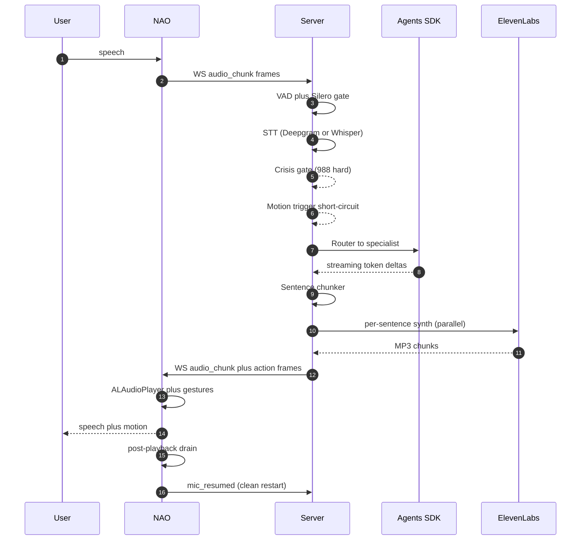
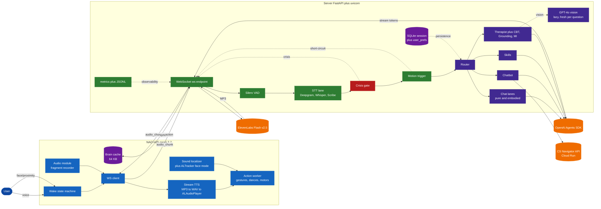
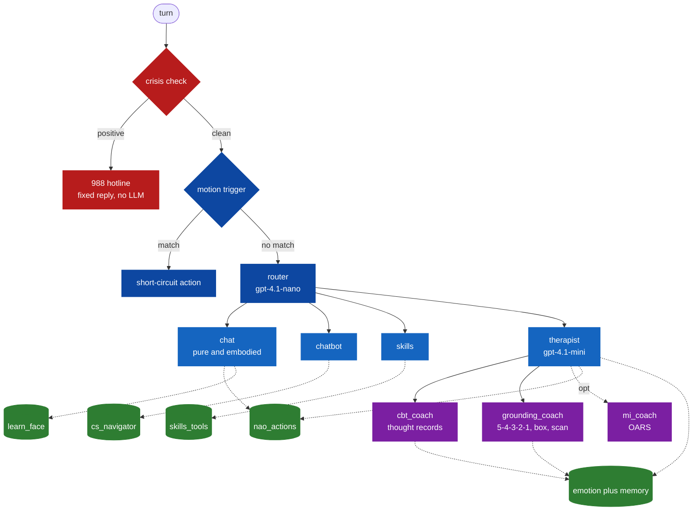
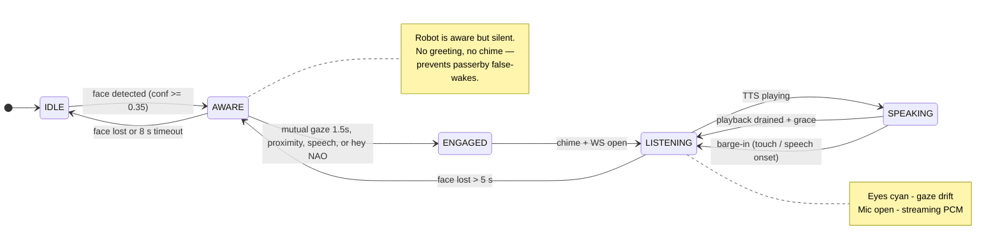
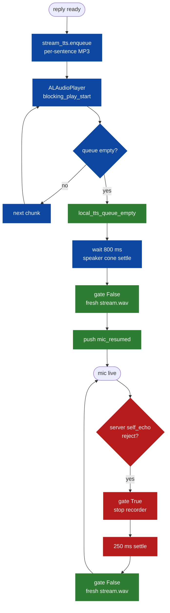
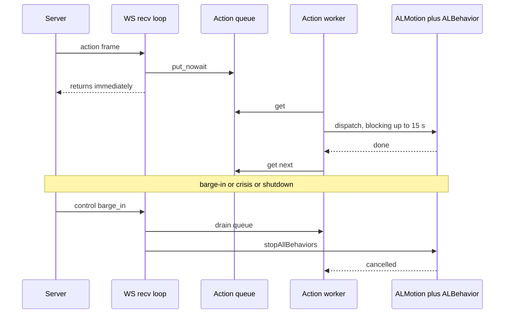
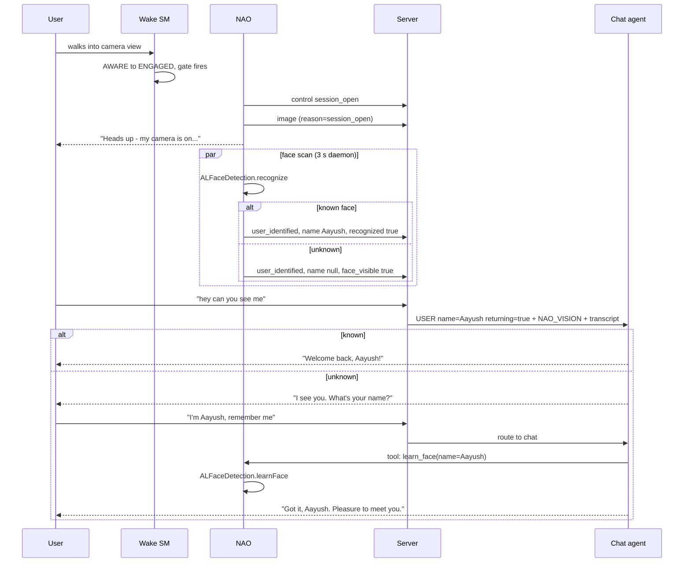
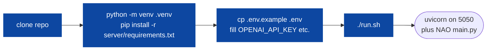

<div align="center">

# Nao‑OpenAI‑Morgan‑Assist

**A real‑time, embodied, multi‑agent voice assistant for the NAO H25 humanoid.**
*Built at Morgan State University · Department of Computer Science.*

<p>
  
  
  
  
  
  
  
  
  
</p>

<sub>Aayush Shrestha · Advised by Dr. Shuangbao "Paul" Wang · Department of Computer Science, Morgan State University</sub>

<br/>


</div>

---

## TL;DR

A NAO humanoid that **listens, sees, thinks, talks, and moves like a person.** A student walks up, NAO recognizes their face, greets them by name, answers questions about courses, weather, or feelings, gestures while talking, turns its head toward whoever speaks, and runs a hardcoded crisis gate that bypasses the LLM entirely on suicidal ideation.

End‑to‑end target: **&lt; 800 ms p50** mouth‑close to first audio.

> **For people new to this repo:** read this README, then [`docs/DECISIONS`](docs/DECISIONS.md) (how problems were navigated), then [`docs/PRD_v2`](docs/PRD_v2.md) (full spec). Index of all docs in [`docs/INDEX`](docs/INDEX.md).

---

## How a turn works



---

## System architecture



---

## Multi‑agent graph



| Agent | Role | Default model |
|---|---|---|
| **router** | triage + handoff (sensory grounding rule, never denies senses) | `gpt-4.1-nano` |
| **chat (pure)** | tool‑less ultra‑fast lane, &lt; 2 s first audio | `gpt-4.1-nano` |
| **chat (embodied)** | gestures + actions + face learn | `gpt-4.1-nano` |
| **chatbot** | Morgan‑CS RAG via CS Navigator API | `gpt-4.1-mini` |
| **skills** | time, weather, timers, todos | `gpt-4.1-nano` |
| **therapist** | empathy + handoffs + vision | `gpt-4.1-mini` |
| **cbt_coach** | Beck thought record (one step per turn) | `gpt-4.1-mini` |
| **grounding_coach** | 5‑4‑3‑2‑1, box breathing, body scan | `gpt-4.1-mini` |
| **mi_coach** | Motivational Interviewing (OARS) — experimental | `gpt-4.1-mini` |
| **crisis** | safety classifier (soft triggers only) | `gpt-4.1` |

---

## Wake state machine



---

## Voice + mic lifecycle (the hard part)



The old design opened the mic on the server's `tts_ended` frame — but that only means the server stopped *sending* audio. The robot's local queue could still play for 5–8 more seconds, and the mic would record NAO's own speaker output. See [`DECISIONS § D8`](docs/DECISIONS.md#d8-mic-lifecycle-tts-ended-vs-playback-drained).

---

## Action dispatch (don't block the recv thread)



See [`DECISIONS § D9`](docs/DECISIONS.md#d9-action-dispatch-on-recv-thread-vs-worker), [`§ D10`](docs/DECISIONS.md#d10-blocking-vs-non-blocking-behavior-calls).

---

## Onboarding flow (face learn)



---

## Highlights at a glance

<table>
<tr><td valign="top" width="50%">

#### Voice loop
- Streaming TTS with sentence chunker
- 3 STT backends, hot‑swap A/B
- Flash v2.5 voice profiles
- 3‑layer self‑echo defense
- Post‑playback mic resume waiter
- Recorder restart on echo reject

#### Multi‑agent
- OpenAI Agents SDK + handoffs
- Pure & embodied chat lanes
- CBT + Grounding + MI sub‑coaches
- Memory injection (recaps, themes)
- Per‑user voice profile in SQLite

#### Vision
- Lazy GPT‑4o, trigger‑phrase gated
- Fresh per question (no stale cache)
- `[NAO_VISION]` prompt block
- Server‑side image stash, never on robot

</td><td valign="top" width="50%">

#### Embodiment
- 47 native gesture intents
- 35‑style dance map
- `follow-me` Choregraphe pack
- Sound‑source localization
- ALTracker face mode
- Action worker thread
- `stopAllBehaviors` cancellation

#### Wake & onboarding
- Hybrid face‑first + keyword fallback
- 5‑state wake SM with LED cues
- Touch‑sensor barge‑in
- Face learn flow + persistent DB
- Camera consent + privacy LED

#### Safety + observability
- Hardcoded 988 crisis gate
- Re‑toned hotline reply
- `structlog` JSON, Prometheus, Grafana
- Robot‑side rotating JSONL
- 22 latency labels, 10 dash panels

</td></tr></table>

---

## Quick start



```bash
git clone https://github.com/theaayushstha1/Nao-OpenAI-Morgan-Assist.git
cd Nao-OpenAI-Morgan-Assist
python3.11 -m venv .venv && source .venv/bin/activate
pip install -r server/requirements.txt
cp .env.example .env             # fill keys
./run.sh                          # deploy to robot + boot uvicorn + tail logs
./run.sh stop                     # tear down
```

`run.sh` rsyncs `nao/` to `/home/nao/nao_assist/`, boots `uvicorn server.app_ws:app` on `:5050`, launches `main.py` on the robot, and tails a signal‑filtered combined log (set `RAW_LOGS=1` to see everything).

---

## Talking to NAO

| Say | Triggers |
|---|---|
| "Hey NAO" / step into view | Wake state machine |
| "Wave at my friend" | `wave_hand` action |
| "Do the kung fu" | `dance(style='kungfu')` -> `KungFu_1` Choregraphe pack |
| "Follow me" / "Track me" | `follow_movement` (`follow-me` pack) |
| "Stop following me" / "Freeze" | `stop_follow` |
| "What am I wearing?" / "Can you see me?" | Lazy GPT‑4o vision call |
| "Switch to a man voice" / "Use my voice" | Voice profile flip (per‑user persisted) |
| "Remember me as Aayush" | `learn_face(name='Aayush')` |
| "Stop watching me" | Camera off for session |
| "Set a 10‑minute timer" | Skills agent |
| "I'm anxious about finals" | Therapist agent |
| "What classes does Morgan offer in spring?" | CS Navigator (chatbot agent) |

Tap NAO's head sensors at any time to **barge in** — TTS stops within ~200 ms, current behavior cancels via `stopAllBehaviors()`.

---

## Performance

| Metric | Target | Where measured |
|---|---|---|
| `e2e_user_to_first_audio` p50 | &lt; 800 ms | `phase_ms` in `turn_complete` log |
| `e2e_user_to_first_audio` p95 | &lt; 1.2 s | Prometheus histogram |
| `tts_synth_first_chunk` | &lt; 500 ms | Flash v2.5 streaming |
| `vision_call` | ~1.5 s | only on visual triggers |
| Barge‑in stop time | &lt; 200 ms | `tts_player.stop()` + `stopAllBehaviors` |

`/metrics` exposes histograms per phase. Grafana JSON in [`server/dashboards/grafana_voice.json`](server/dashboards/grafana_voice.json).

---

## Repo layout

```
Nao-OpenAI-Morgan-Assist/
├── nao/                      Python 2.7 — runs on the robot
│   ├── main.py               entry: wake SM + session controller
│   ├── ws_client.py          long-lived WebSocket session
│   ├── audio_module.py       ALAudioRecorder fragment streamer
│   ├── stream_tts.py         MP3 -> WAV -> ALAudioPlayer + ffmpeg loudness
│   ├── wake_state.py         IDLE -> AWARE -> ENGAGED -> LISTENING -> SPEAKING
│   ├── sound_localize.py     ALSoundLocalization auto-track
│   ├── leds.py               eye LED helpers
│   ├── idle_motion.py        background breathing + gaze drift
│   └── utils/
│       ├── nao_execute.py    dispatcher: gestures, dances, motors
│       ├── face_naoqi.py     face recognition + learning
│       ├── brain.py          64 KB local identity cache
│       └── camera_capture.py per-turn JPEG snap
│
├── server/                   Python 3.11+ — runs on dev / cloud
│   ├── app_ws.py             FastAPI + WebSocket — main entry
│   ├── safety.py             pre-dispatch crisis gate (988)
│   ├── motion_trigger.py     regex short-circuit for body commands
│   ├── streaming.py          sentence chunker for streaming TTS
│   ├── elevenlabs_tts.py     Flash v2.5 streaming with voice profiles
│   ├── deepgram_asr.py       Nova-2 streaming STT
│   ├── elevenlabs_stt.py     Scribe v2 Realtime STT
│   ├── vad_silero.py         server-side authoritative voice gate
│   ├── memory.py             recaps, weekly themes, monthly personas
│   ├── session.py            SQLiteSession + camera consent
│   ├── logging_setup.py      structlog JSON
│   ├── metrics.py            Prometheus exporter
│   ├── dashboards/           Grafana JSON
│   ├── agents/               router, chat, chatbot, skills, therapist, ...
│   └── tools/                nao_actions, cs_navigator, emotion, skills
│
├── sim/                      Python 3.11+ — load test + benchmarks
├── docs/                     PRD, DECISIONS, INDEX, phase task maps
└── run.sh                    one-shot deploy + boot + log tail
```

---

## Documentation

| Tier | Doc | What it gives you |
|---|---|---|
| 1 | [`docs/INDEX`](docs/INDEX.md) | Doc graph + tag glossary |
| 1 | [`docs/DECISIONS`](docs/DECISIONS.md) | **How problems were navigated** — 12 key decisions with the why |
| 1 | [`docs/PRD_v2`](docs/PRD_v2.md) | 600‑line product/architecture spec, 9 phases |
| 2 | [`docs/spike_results`](docs/spike_results.md) | Phase 0.5 — FastAPI WS vs Realtime API benchmark |
| 3 | `docs/PHASE_*_TASK_MAP` | Per‑phase delivery plans with shared contracts |

Every doc carries an HTML‑comment frontmatter block with `tags:` and `related:` so they're greppable and graph‑traversable. Search example:

```bash
grep -lZ "tags:.*embodiment" docs/*.md      # every doc tagged with embodiment
grep -lZ "related:.*PHASE_4"  docs/*.md     # every doc that links to Phase 4
```

---

## Configuration

`.env` essentials (full list in `.env.example`, **never commit `.env`**):

```ini
OPENAI_API_KEY=sk-...
ELEVENLABS_API_KEY=...
ELEVENLABS_VOICE_GIRL=21m00Tcm4TlvDq8ikWAM
ELEVENLABS_VOICE_MAN=...
ELEVENLABS_VOICE_NEUTRAL=...
ELEVENLABS_VOICE_MY=...                    # cloned "my voice" (optional)
DEEPGRAM_API_KEY=...                        # optional, fastest STT
NAO_IP=172.20.95.127                        # robot LAN IP
NAO_PASSWORD=...                            # SSH for run.sh deploy (gitignored)
NAO_SHARED_SECRET=...                       # WS auth between robot and server
SERVER_IP=192.168.x.x                       # this machine's LAN IP
USE_WS=1                                    # FastAPI + WebSocket transport
```

Full env reference: see [`server/config.py`](server/config.py).

---

## Testing

```bash
pytest -q                       # 30 unit + integration tests
python -m sim.live_proof         # full pipeline soak test
python -m sim.stt_ab             # A/B Deepgram vs Whisper vs Scribe
python -m sim.chat_model_bench   # per-model latency
```

---

## NAO connection cheatsheet

```bash
ssh nao@$NAO_IP                                      # CS network
rsync -avz --delete nao/ nao@$NAO_IP:/home/nao/nao_assist/
qicli call ALBehaviorManager.getInstalledBehaviors   # 915 behaviors
qicli call ALBehaviorManager.runBehavior "follow-me"
qicli call ALBehaviorManager.stopAllBehaviors
```

VS Code Remote‑SSH:

```
Host nao
  HostName 172.20.95.127
  User nao
```

---

## Acknowledgments

- **Dr. Shuangbao "Paul" Wang** for advising the SAGE‑CBT research direction
- **Morgan State Department of Computer Science** for NAO + lab access
- **OpenAI**, **Anthropic Claude Code**, **ElevenLabs**, **Deepgram**, **Aldebaran/SoftBank Robotics**

## License

MIT — see [`LICENSE`](LICENSE).
