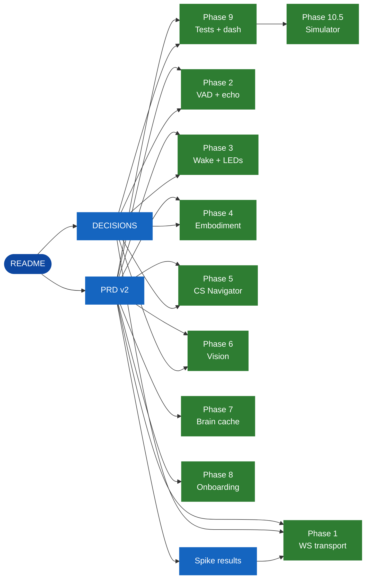

<!--
title: Documentation Index
tags: [index, navigation, toc]
related: [DECISIONS, PRD_v2, spike_results]
status: living-document
-->

# Documentation Index



## Tier 1 — start here

| Doc | What it gives you |
|---|---|
| [`README`](../README.md) | Project overview, mermaid diagrams, quick start |
| [`DECISIONS`](DECISIONS.md) | Why we chose what we chose; how problems were navigated |
| [`PRD v2`](PRD_v2.md) | 600‑line spec, 9 phases, vessel→brain vision |

## Tier 2 — research & spikes

| Doc | What it gives you |
|---|---|
| [`spike_results`](spike_results.md) | Phase 0.5 — FastAPI WS vs Realtime API benchmark |

## Tier 3 — per‑phase delivery

| Phase | Doc | Topic |
|---|---|---|
| 1 | [`PHASE_1_TASK_MAP`](PHASE_1_TASK_MAP.md) | FastAPI + WebSocket transport, observability skeleton |
| 2 | [`PHASE_2_TASK_MAP`](PHASE_2_TASK_MAP.md) | VAD + echo hardening |
| 3 | [`PHASE_3_TASK_MAP`](PHASE_3_TASK_MAP.md) | Hybrid face‑first wake + state machine + LEDs |
| 4 | [`PHASE_4_TASK_MAP`](PHASE_4_TASK_MAP.md) | Active embodiment — gestures + sound localization |
| 5 | [`PHASE_5_TASK_MAP`](PHASE_5_TASK_MAP.md) | CS Navigator API — Pinecone replacement |
| 6 | [`PHASE_6_TASK_MAP`](PHASE_6_TASK_MAP.md) | Therapist vision‑on + camera consent |
| 7 | [`PHASE_7_TASK_MAP`](PHASE_7_TASK_MAP.md) | Robot‑side brain cache |
| 8 | [`PHASE_8_TASK_MAP`](PHASE_8_TASK_MAP.md) | Onboarding polish + face learn |
| 9 | [`PHASE_9_TASK_MAP`](PHASE_9_TASK_MAP.md) | Tests + Grafana dashboard |
| 10.5 | [`PHASE_10_5_TASK_MAP`](PHASE_10_5_TASK_MAP.md) | Simulator + proof reports |

## Tag glossary

Each doc carries a `tags:` array in its HTML‑comment frontmatter. Common tags:

`architecture`, `transport`, `websocket`, `fastapi`, `vad`, `echo-guard`, `wake`, `face-detection`, `state-machine`, `embodiment`, `gestures`, `sound-localization`, `rag`, `cs-navigator`, `vision`, `camera-consent`, `privacy`, `brain-cache`, `onboarding`, `testing`, `prometheus`, `grafana`, `simulator`, `decisions`, `post-mortem`, `debugging`.

Search example:

```bash
# Find every doc tagged with `embodiment`
grep -lZ "tags:.*embodiment" docs/*.md
```
