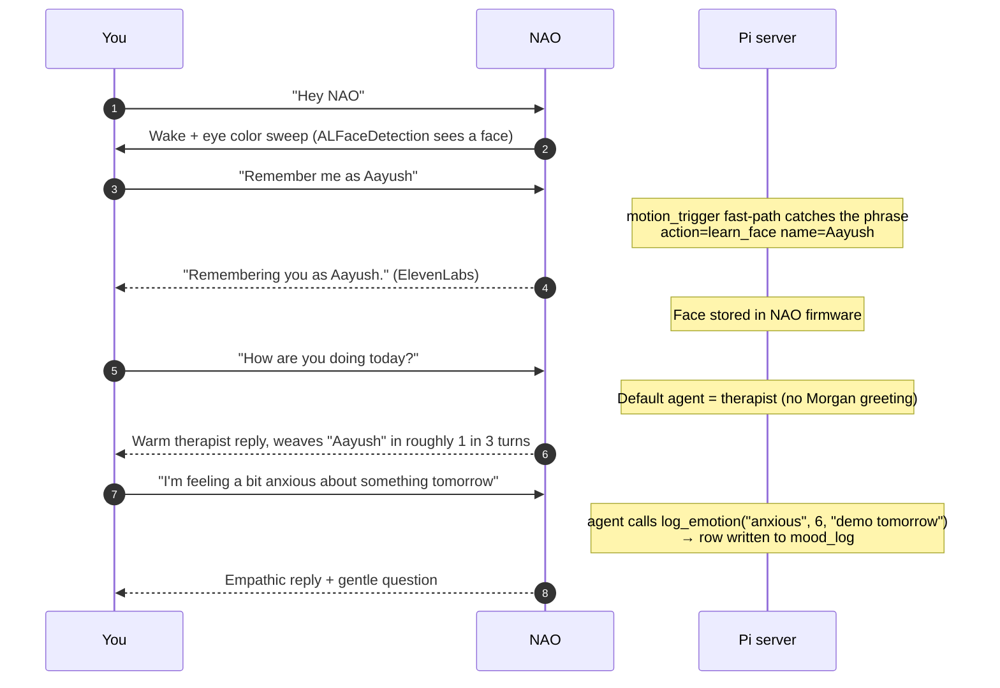
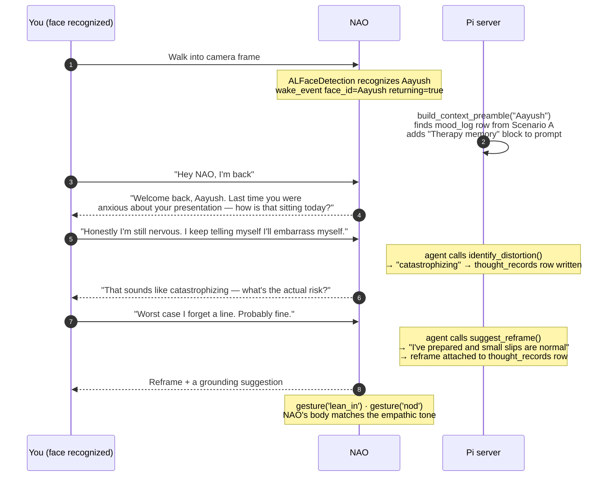
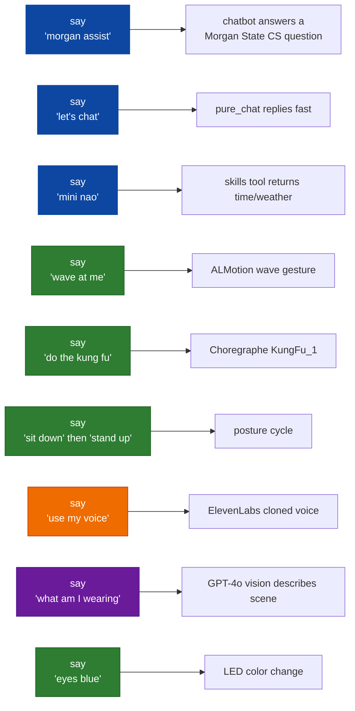
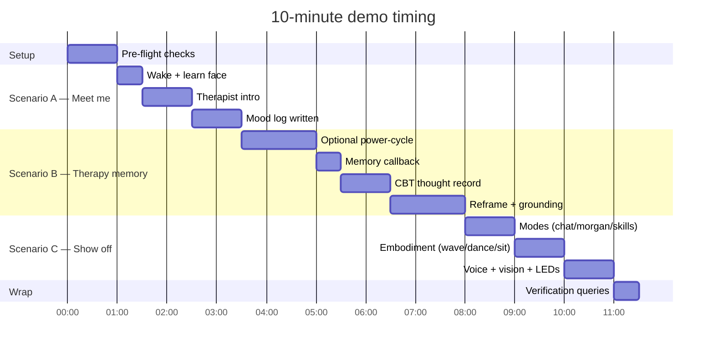

# NAO‑SAGECBT — 10‑minute end‑to‑end demo

> A scripted run that exercises every major feature in roughly 10 minutes. Designed for a live audience but works just as well as a solo verification pass after a deploy.

---

## Pre‑flight checklist (60 seconds)


Run these once before walking in front of the audience:

```bash
ssh nao@172.20.95.106 'sudo systemctl is-active nao-server'
ssh nao@172.20.95.127 'ps aux | grep main.py | grep -v grep'
ssh nao@172.20.95.127 'qicli call ALFaceDetection.getLearnedFacesList'
```

| Output                                    | Meaning                                                         |
| ----------------------------------------- | --------------------------------------------------------------- |
| `active` + a `python -u .../main.py` line | All good                                                        |
| Face list shows `["Aayush"]`              | You're already known — Scenario B will hit "Welcome back" immediately |
| Face list is `[]`                         | Fresh start — run Scenario A first to populate                  |

---

## Feature coverage map

```mermaid
flowchart TB
    classDef scA fill:#1565c0,stroke:#0d47a1,color:#fff
    classDef scB fill:#6a1b9a,stroke:#4a148c,color:#fff
    classDef scC fill:#ef6c00,stroke:#bf360c,color:#fff

    A[Scenario A · "Meet me"]:::scA --> A1[Face learn via motion_trigger]
    A --> A2[Bare wake → therapist default]
    A --> A3[Proactive name use]
    A --> A4[Mood log written]

    B[Scenario B · "Therapy that remembers"]:::scB --> B1[Memory preamble surfaces last mood]
    B --> B2[CBT thought record + reframe]
    B --> B3[Empathic gestures]
    B --> B4[Mood trajectory across turns]

    C[Scenario C · "Show off the rest"]:::scC --> C1[Multi-mode router · Morgan / chat / skills]
    C --> C2[Embodiment · wave / dance / sit / stand]
    C --> C3[Voice profile picker · man / girl / my]
    C --> C4[Vision · what am I wearing]
    C --> C5[LED color change]
```

---

## Scenario A — "Meet me" (3 minutes)

**Persona**: New user walks up to NAO for the first time. We want them remembered.



### Exact lines to say (in order)

1. "Hey NAO"
2. "Remember me as Aayush"
3. "How are you doing today?"
4. "I'm feeling a bit anxious about my presentation tomorrow"
5. "Thanks for listening — I'll talk to you again later"

### What to listen for

| Line | Expected |
|------|----------|
| 1 | NAO orients head toward you, eyes shift color, no spoken response yet |
| 2 | ElevenLabs voice says "Remembering you as Aayush." — short, clear |
| 3 | Therapist reply opens conversationally. Should NOT say "How can I help you with Morgan State" |
| 4 | Empathic reply, may use your name, asks a follow‑up question |
| 5 | Warm goodbye |

### Verify afterward

```bash
ssh nao@172.20.95.106 \
  'sqlite3 ~/nao-sagecbt/server/nao.db "SELECT username,mood,intensity,trigger FROM mood_log ORDER BY id DESC LIMIT 3"'
```

Expect a row like `aayush|anxious|6|presentation tomorrow`.

---

## Scenario B — "Therapy that remembers" (4 minutes)

**Persona**: Same user returns later in the day. NAO should pick up where it left off.

### The reset

If you want to test cold‑boot memory continuity (the strongest demo), power‑cycle NAO between scenarios:

1. Hold chest button ~5 s → "Gnuk gnuk" → eyes dark
2. Press chest button → boots
3. Wait 90 s for NAOqi + autostart

Skip if pressed for time — the memory is in SQLite on the Pi, not on the robot. NAO doesn't need to reboot for memory to work.



### Exact lines to say (in order)

1. "Hey NAO, I'm back"
2. "Honestly I'm still nervous. I keep telling myself I'll embarrass myself in front of everyone"
3. "Worst case I forget a line. Probably it's fine."
4. "What's a quick thing I can do to calm down right now?"
5. "That helped. Thank you."

### What to listen for

| Line | Expected |
|------|----------|
| 1 | **Therapist opens with a memory callback** — mentions yesterday's anxiety / presentation. This is the headline feature. |
| 2 | Therapist labels the thought pattern (catastrophizing or similar), gently |
| 3 | Therapist offers a reframe that captures your own words |
| 4 | Therapist hands to grounding sub‑coach — box breathing or 5‑4‑3‑2‑1 |
| 5 | Warm close, may reference building a small win |

### Verify afterward

```bash
ssh nao@172.20.95.106 \
  'sqlite3 ~/nao-sagecbt/server/nao.db "SELECT thought, distortion, reframe FROM thought_records ORDER BY id DESC LIMIT 2"'
```

Expect a row with the catastrophizing thought you spoke and the reframe NAO offered.

---

## Scenario C — "Show off the rest" (3 minutes)

**Persona**: Demo dazzler. Quick fire through every other capability.



### Quick fire (each line gets one expected behavior, ~15 seconds each)

| # | You say                            | Expected                                                                                  |
| - | ---------------------------------- | ----------------------------------------------------------------------------------------- |
| 1 | "Nao. Morgan assist."              | Mode‑entry, then chatbot greets                                                           |
| 2 | "What CS courses does Morgan offer this fall?" | Chatbot replies from CS Navigator knowledge                                  |
| 3 | "Nao. Let's chat."                 | Switch to chat mode                                                                       |
| 4 | "Tell me a joke."                  | Pure chat, lightweight, fast                                                              |
| 5 | "Wave at me."                      | NAO waves                                                                                 |
| 6 | "Do the kung fu."                  | NAO performs the KungFu_1 Choregraphe routine                                             |
| 7 | "Sit down."                        | NAO transitions to seated posture                                                          |
| 8 | "Stand up."                        | NAO returns to StandInit                                                                  |
| 9 | "Switch to a man voice."           | ElevenLabs voice changes to the male profile                                              |
| 10 | "Use my voice."                    | ElevenLabs voice switches to the cloned voice                                             |
| 11 | "What am I wearing right now?"    | GPT‑4o vision call fires fresh (no cache), NAO describes your clothing                    |
| 12 | "Make your eyes purple."           | Eye LEDs change                                                                           |
| 13 | "Nao. Therapy."                    | Returns to therapist for a clean close                                                    |

---

## Recovery plays (when something acts up)

```mermaid
flowchart TB
    classDef issue fill:#b71c1c,stroke:#7f0000,color:#fff
    classDef fix fill:#1565c0,stroke:#0d47a1,color:#fff

    NV[Hearing NAO native kid voice]:::issue --> NVfix[verify .bash_profile autostart<br/>still disabled · check setVolume(1.0)<br/>did not slip back in]:::fix
    NL[No reply for >10 seconds<br/>after speaking clearly]:::issue --> NLfix[mic stalled · launcher.log will show<br/>'mic stalled too long' followed by<br/>'recorder restarted after stall']:::fix
    MG[Morgan greeting on bare wake]:::issue --> MGfix[server out of sync · pull main on Pi<br/>and restart nao-server]:::fix
    NM[No memory callback on return]:::issue --> NMfix[face DB empty or face_id mismatch<br/>· run forgetPerson if duplicate, relearn]:::fix
```

| Symptom                                        | Quick fix                                                                                          |
| ---------------------------------------------- | -------------------------------------------------------------------------------------------------- |
| Kid voice anywhere                             | `ssh nao@172.20.95.127 'qicli call ALTextToSpeech.setVolume 0.0'`                                  |
| Mid‑conversation silence                       | Tail launcher log: `ssh nao@172.20.95.127 'tail -40 /tmp/launcher.log'` — look for restart line     |
| Morgan greeting on bare wake                   | Pi out of date: `ssh -t nao@172.20.95.106 'cd ~/nao-sagecbt && git pull && sudo systemctl restart nao-server'` |
| No memory callback                             | Verify `mood_log` and `thought_records` rows exist with matching lowercase username                |
| Two main.py processes                          | `.bash_profile` autostart leaked back — neutralize again, see `~/.bash_profile.old_nao_chat_backup.*` |

---

## Post‑demo verification (30 seconds)

After the run, prove the full loop worked end‑to‑end:

```bash
# Memory rows exist
ssh nao@172.20.95.106 \
  'sqlite3 ~/nao-sagecbt/server/nao.db \
   "SELECT '"'mood'"' as kind, username, mood||' (' ||intensity||'/10)' as detail, trigger FROM mood_log \
    UNION ALL \
    SELECT '"'thought'"' as kind, username, distortion, reframe FROM thought_records \
    ORDER BY kind, rowid DESC LIMIT 10"'

# Face was learned and persisted
ssh nao@172.20.95.127 'qicli call ALFaceDetection.getLearnedFacesList'

# Server saw your turns
ssh -t nao@172.20.95.106 \
  'sudo journalctl -u nao-server -n 200 --no-pager | grep -E "active_agent|reply_preview|turn_complete" | tail -15'
```

If all three return the expected rows / IDs / log lines, the demo passed end‑to‑end.

---

## Talking points for the audience (optional 30‑sec sound bites)

| Moment | Say to audience |
|--------|-----------------|
| Right after "remember me as Aayush" | "That phrase was caught by a motion‑trigger fast‑path before the LLM even saw the turn — same reason NAO never speaks the same sentence twice." |
| Right after the memory callback in Scenario B | "NAO just read its own SQLite memory of our last conversation. The therapist agent gets a 'Therapy memory' block in its prompt every turn." |
| Right after the CBT thought record | "That's a Beck CBT thought record — thought, distortion, reframe. It's written to the same SQLite database so the next session has continuity." |
| Right after the kung fu | "47 native gestures plus Choregraphe behaviors. The agent picks one per turn based on emotional intent." |
| Right after vision | "Vision is lazy — only fires on trigger phrases like 'what am I wearing'. No cache between users, so a friend asking the same question gets a fresh answer about them." |
| Right after voice switch | "Three voices: girl, man, and my own cloned voice from ElevenLabs. The choice persists per user." |

---

## Timing budget



Total: ~10 minutes including pre‑flight. Compressible to 6 minutes by skipping the power‑cycle in Scenario B and trimming Scenario C to the strongest 4 lines.
